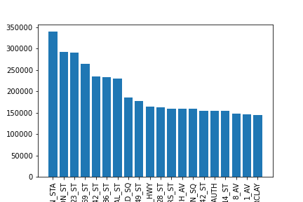
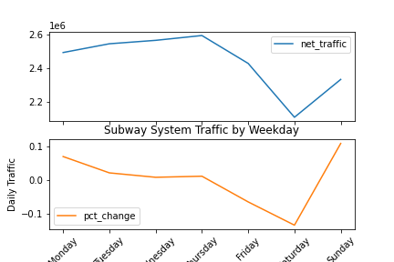
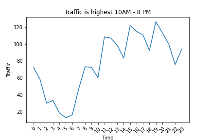
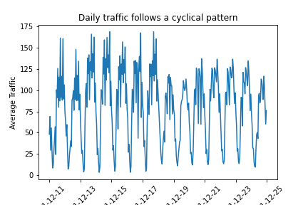

## Subway Traffic Analysis for Digital Signage

The goal of this project is to identify the NYC subway stations with the most traffic, and the times of day/days of the week they are most busy.

To do this, I aggregated the turnstile data by station, performed a considerable amount of data cleaning, and plotted the sum of the traffic for each station as seen below.

To help contextualize the baseline findings about station traffic, I included this graph which shows the average traffic for all stations on each day of the week.

Drilling down further, this visualization shows the average traffic for all stations for each hour over a 24 hour period.

This plot is a timelase visualization of the average traffic in hourly increments over the time period of the dataset.

My initial findings suggest that the majority of subway traffic moves through a small number of key hubs. These include Penn Station, Fulton Street, Grand Central, Union Square, Barclays Center, 8th Avenue. There is a cyclicality to the traffic as well, with the majority passing through the system between 7 AM and 8 PM. Saturday is the lowest day in terms of traffic, and Thursday is the highest.

Further goals for this project are to merge Borough, geographical, and demographic data into the original dataframe so that top stations by boro, and prevailing demographics for each boro can be identified programmatically.
